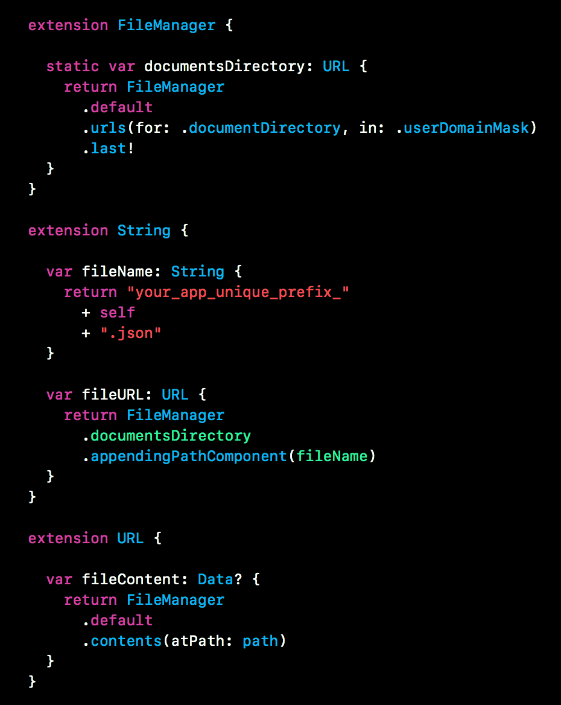

# Swift snippet #13— Extension Oriented API
Tuesday, 3rd October, 2017 

I posted my last swift snippet way back in March, so roughly it’s been 6 months now and I don’t feel good about it but a lot has happened since then. Now I’m rekindling this series of snippets and hopefully will continue posting for a longer time 💪.



You can find its [Gist here!](https://gist.github.com/riteshhgupta/0bce24a1ce8a9b93f857fc8cf0e41ba3)

With this post, I would like to highlight the power & relevance of creating `Extensions`. In my recent app I had to use `FileManager` apis and it’s really easy to use them btw. But after using it at couple of places, I was calling the same functions again, `FileManager.default.contents(atPath: path)` or `FileManager.default.someFunc()`. I felt it could be refactored and thus got the idea of converting the same api into more extension oriented rather than function oriented where you have to pass the argument.

If you observe the above api, it takes exactly one argument and thus we can make an extension on that argument to achieve the same result which, in this case, adds two benefits. It makes the new api,

- **inline** (you can get the same result by using dot notation)
- **shorter** (makes it easier to read)

Let's say we want to read the contents of a json file name `"model_user"`. With the above extensions, now you can achieve something like this, 

```
let userData = "model_user".fileURL.fileContent
```
 
- `fileName` make sure that we have a centralised variable to do any processing on the file name so that the chances of getting it wrong reduces. 
- `fileURL` gets the correct url of the file from the document's directory, eliminating the need to figure out how to get the document directory's url.
- `fileContent` uses the FileManager api to get the required data

Thus the final api is dependent on smaller pieces of logic which are abstracted into extensions. If you want you can make the api even shorter by using the below extension,

```
extension String {

	var fileContent: Data? {
		return fileURL.fileContent
	}
}

let userData = "model_user".fileContent
```
